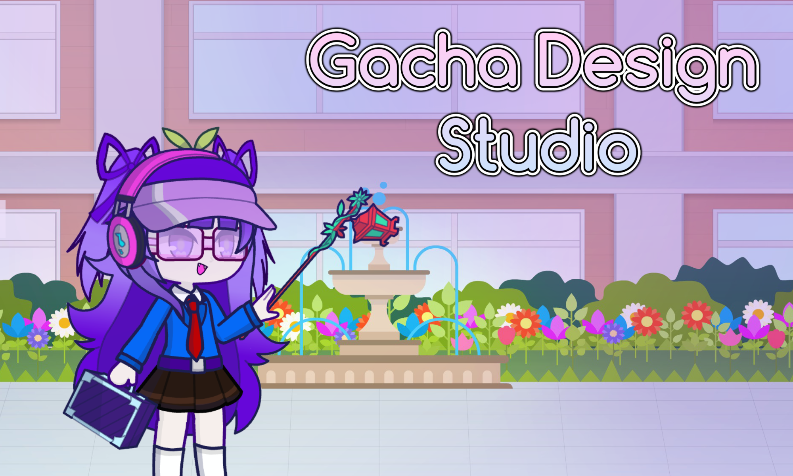
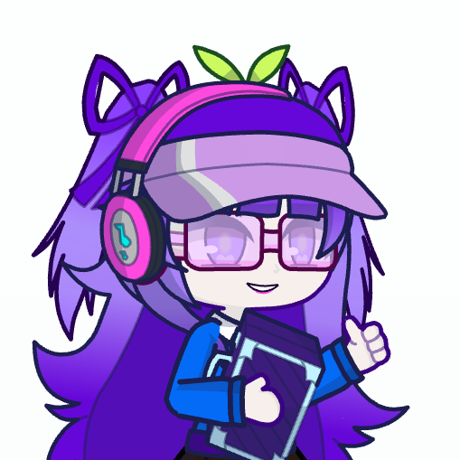
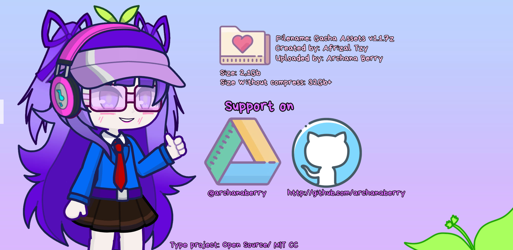
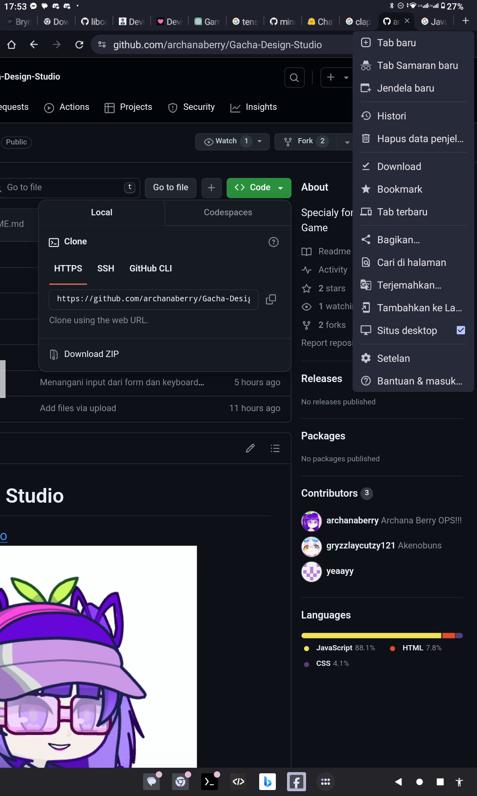
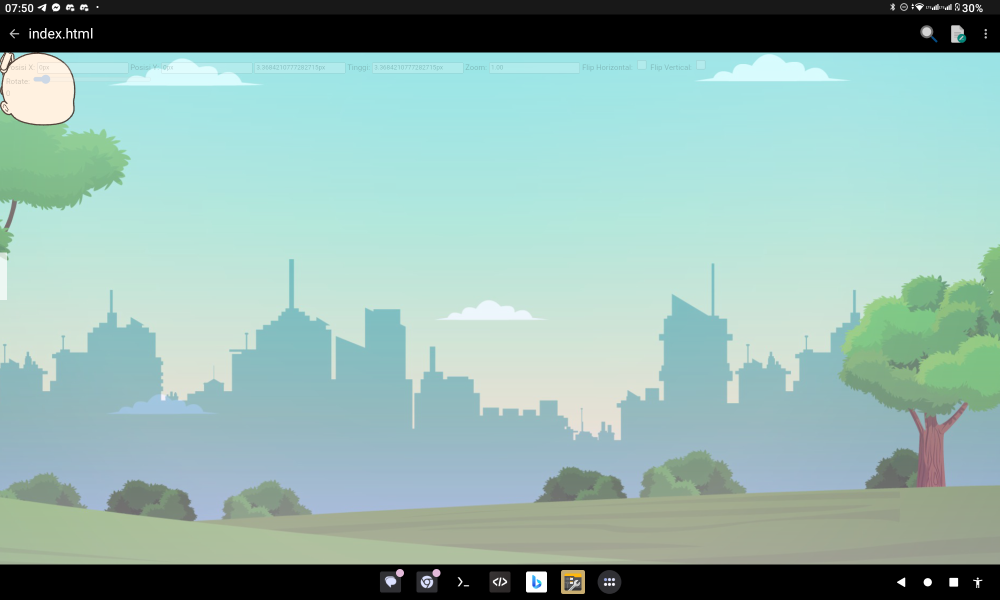
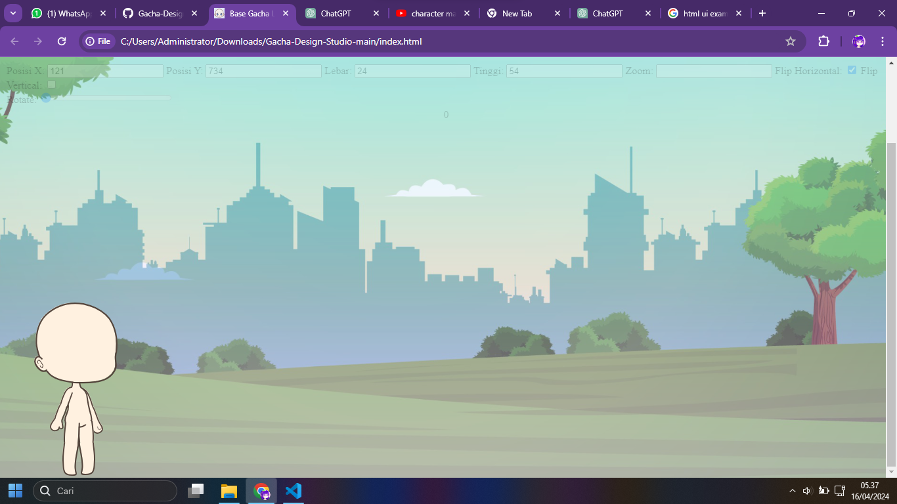

# Gacha Design Studio

Gacha Design Studio adalah sebuah game fanmade (buatan dari para penggemar) yang mengambil inspirasi dari Gacha Life 2 yang dikembangkan oleh Lunime. Game ini memungkinkan pemain untuk merancang karakter, memilih pakaian, dan menciptakan desain yang unik.

## Fitur Utama

| Fitur             | Deskripsi                                                                                   |
|-------------------|----------------------------------------------------------------------------------------------|
| Pembuatan Karakter| Buat karakter unik dengan berbagai pilihan wajah, mata, rambut, dan aksesoris.               |
| Desain Pakaian    | Desain pakaian dengan berbagai motif, warna, dan gaya untuk karakter yang dibuat.            |
| Studio Foto       | Ambil foto karakter yang telah dibuat dalam berbagai pose dan latar belakang yang berbeda.  |
| Mode Fashion Show | Tunjukkan desain pakaian terbaik Anda dalam kompetisi mode virtual dengan pemain lain.      |
| Koleksi Item      | Kumpulkan berbagai item fashion dan aksesoris untuk menambah variasi dalam desain Anda.      |
| Berbagi karakter  | Bagikan karakter anda untuk berkolaborasi dengan teman anda lewat kode karakter dan juga impor |
| Aset Vektor       | Menjadikan kualitas gambar di karakter gacha mu jadi tajam dan tanpa penurunan kualitas hanya saja sedikit lagyy |
| Map Vektor        | Sebuah map dunia fiktif permainan yang menjadikan nya sangat luas tanpa penurunan kualitas dan bisa di zoom |
| Studio Pose       | Buatlah pose dengan mudah dengan gaya karakter yang anda inginkan dan animasi pose (untuk animasi ditunggu) |
| Bisa dimainkan secara offline | Kamu bebas memainkan game ini disaat tanpa ada kuota internet dengan sepuas puas nya UwU |

## Link

Kunjungi [Gacha Life 2 Assets](https://drive.google.com/file/d/1RKEoUYibFckKS10PS7cGm9bbfmgZJIp2/view?usp=drive_link) untuk berkustomisasi karakter yang anda inginkan UwU.

## Cara buka?
Kamu tinggal download repositori ini dengan chrome, nyalakan mode desktop, lalu pencet download zip.
Setelah berhasil download buka file `index.html` nya dan langsung rangkai sesuka mu XD

* Ini dia

## Kekurangan dan Kendala

* ✅ Berhasil di tangani.
* ❎ Belum di tangani.

| Kekurangan                                    | Deskripsi                                                                                      | Status |
|-----------------------------------------------|------------------------------------------------------------------------------------------------|--------|
| Keterbatasan Aset                             | Saat ini, game masih terbatas dalam jumlah aset yang tersedia karena baru dirilis.             | ❎ |
| Karakter Dummy/Template                       | Karakter dalam game masih dalam bentuk dummy atau template kosong, belum memiliki rambut atau aksesori yang lengkap. | ❎ |
| Zoom Belum Aktif                              | Fitur zoom untuk melihat detail lebih jauh dalam pembuatan karakter atau desain pakaian masih belum aktif. | ✅ |
| Flip Vertikal dan Horizontal Bermasalah      | Fitur flip vertikal dan horizontal saat ini mengalami masalah teknis yang membuatnya ngebug.   | ✅ |
| Selektor Karakter Belum Aktif Sepenuhnya     | Selektor karakter masih belum berfungsi sepenuhnya, sehingga pengguna belum dapat dengan mudah memilih karakter yang ingin dimodifikasi. | ✅ |
| Tidak Ada Fitur Berbagi Karakter dengan Kode atau Upload Aset SVG | Fitur untuk berbagi karakter menggunakan kode atau mengunggah aset SVG sebagai tambahan aset belum ditambahkan. | ❎ |
| Input box posisi Y, Lebar/Width, dan Tinggi/Height nya bermasalah | Ketika bisa diubah nilai nya tetapi tidak mengalami perubahan posisi | ❎ |
| Pengingat jika tidak sengaja ke refresh | Untuk mencegah kehilangan posisi pose ataupun rangkai karakter Gacha mu | ❎ |

## Tangkapan Layar

Tablet 2000x1200 (Landscape mode)

PC/Laptop 1366x768 (Landscape mode)
Diperbarui

