# Gacha Design Studio

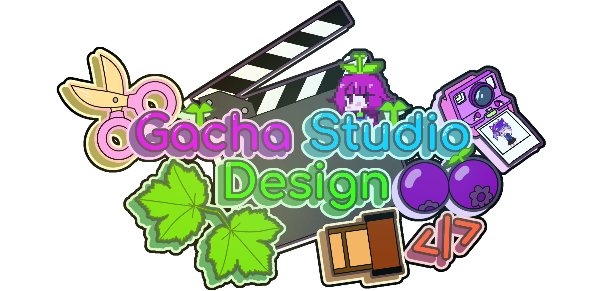
<!--`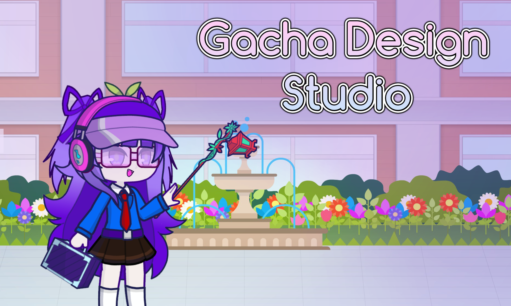-->

# Tipe cabang (branch) repositori
* DL untuk edisi didownload agar bisa dimainkan resource game nya pakai game browser GachaDesignStudio.apk (com.lunime.githubcollab.archanaberry.gachadesignstudio)
* HS untuk edisi hosting online di vps/panel/termux agar bisa bantu dikembangkan untuk server dan dimainkan dengan bersama kolaborator tetapi harus pakai game browser engine khusus

# Ikon aplikasi web nya

#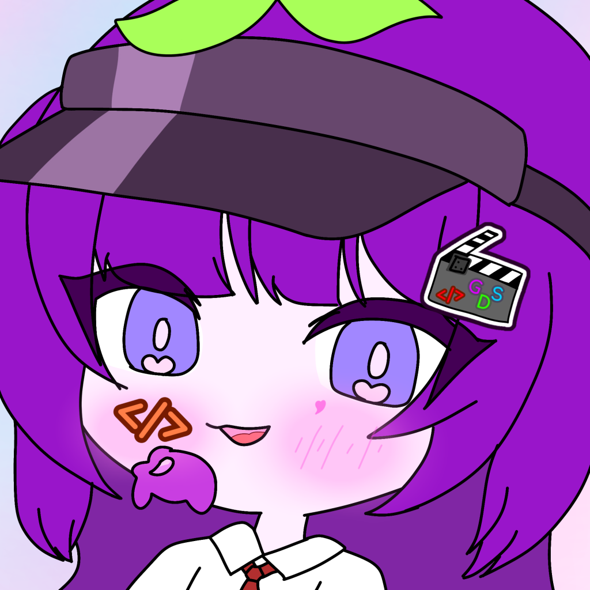

Gacha Design Studio adalah sebuah game fanmade (buatan dari para penggemar) yang mengambil inspirasi dari Gacha Life 2 amupun game Gacha lainnya yang dikembangkan oleh Lunime. Game ini memungkinkan pemain untuk merancang karakter, memilih pakaian, dan menciptakan desain yang unik yang lebih bebas berlayout.

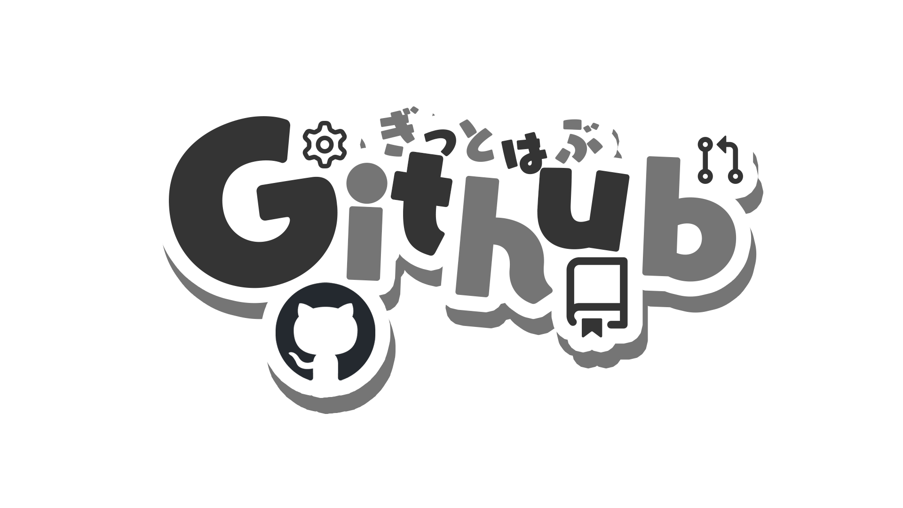

## Fitur Utama

| Fitur             | Deskripsi                                                                                   |
|-------------------|----------------------------------------------------------------------------------------------|
| Pembuatan Karakter| Buat karakter unik dengan berbagai pilihan wajah, mata, rambut, dan aksesoris.               |
| Desain Pakaian    | Desain pakaian dengan berbagai motif, warna, dan gaya untuk karakter yang dibuat.            |
| Studio Foto       | Ambil foto karakter yang telah dibuat dalam berbagai pose dan latar belakang yang berbeda.  |
| Mode Fashion Show | Tunjukkan desain pakaian terbaik Anda dalam kompetisi mode virtual dengan pemain lain.      |
| Koleksi Item      | Kumpulkan berbagai item fashion dan aksesoris untuk menambah variasi dalam desain Anda.      |
| Berbagi karakter  | Bagikan karakter anda untuk berkolaborasi dengan teman anda lewat kode karakter dan juga impor |
| Aset Vektor       | Menjadikan kualitas gambar di karakter gacha mu jadi tajam dan tanpa penurunan kualitas hanya saja sedikit lagyy |
| Map Vektor        | Sebuah map dunia fiktif permainan yang menjadikan nya sangat luas tanpa penurunan kualitas dan bisa di zoom |
| Studio Pose       | Buatlah pose dengan mudah dengan gaya karakter yang anda inginkan dan animasi pose (untuk animasi ditunggu) |
| Bisa dimainkan secara offline | Kamu bebas memainkan game ini disaat tanpa ada kuota internet dengan sepuas puas nya UwU |

## Progres Aset Sisipan
Berikut adalah tabel README yang menjelaskan bagian "Kustomisasi," termasuk deskripsi singkat, bagian-bagian terkait, dan status ketersediaan fitur.  

| **Bagian**     | **Deskripsi Singkat**                                  | **Bagian-Bagian**                         | **Ketersediaan Fitur** |
|-----------------|-------------------------------------------------------|-------------------------------------------|-------------------------|
| **Prasetel**    | Pilihan untuk memuat atau menyimpan desain karakter.  | Simpan, Muat, Reset, Hapus                | ❌                      |
| **Warna**       | Pengaturan warna sisipan svg karakter.                     | Ubah warna sisipan svg, fill, stroke               | ✅                      |
| **Badan**       | Pengaturan bentuk tubuh karakter.                     | Tinggi, Bentuk, Warna Kulit               | ✅                      |
| **Kaki**       | Pengaturan bentuk kaki karakter.                      | Tinggi, Bentuk, Warna Kulit               | ✅                      |
| **Rambut**      | Kustomisasi gaya rambut karakter.                     | Gaya, Warna, Highlight, Aksesoris         | 💡                      |
| **Wajah**       | Kustomisasi fitur wajah karakter.                     | Mata, Mulut, Alis, Warna                  | ✅                      |
| **Telinga**      | Kustomisasi gaya telinga karakter.                     | Gaya, Warna, Highlight, Aksesoris Telinga         | ✅                      |
| **Kepala**      | Pengaturan aksesori dan ornamen kepala.               | Topi, Pita, Mahkota                       | ✅                      |
| **Atasan**      | Pilihan pakaian bagian atas.                          | Baju, Jaket, Rompi                        | 💡                      |
| **Bawahan**     | Pilihan pakaian bagian bawah.                         | Celana, Rok, Celana Pendek                | 💡                      |
| **Lebih (Extra)**| Aksesori tambahan untuk gaya karakter.               | Sayap, Ekstra Dekorasi, Warna             | 📃                      |
| **Profil**      | Pengaturan informasi dasar tentang karakter.          | Nama, Deskripsi, Usia, Hobi, thumbnail karakter.               | 💡                      |

### Penjelasan Status
- **✅**: Fitur sudah dibuat dan berfungsi dengan baik.  
- **❌**: Fitur belum dibuat atau belum berfungsi sesuai rencana.  

Apakah ada bagian yang perlu ditambahkan atau diperjelas?

## Link

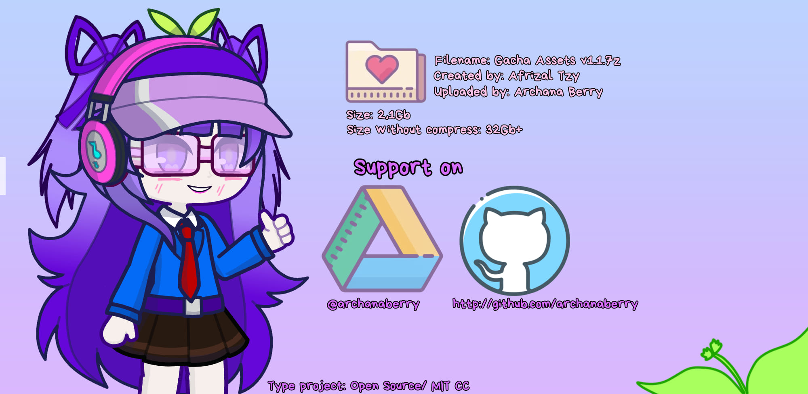
Kunjungi [Gacha Life 2 Assets](https://drive.google.com/file/d/1RKEoUYibFckKS10PS7cGm9bbfmgZJIp2/view?usp=drive_link) untuk berkustomisasi karakter yang anda inginkan UwU.

# Untuk saat ini versi aset nya masih v0.16_alpha...

## Cara buka?
Kamu tinggal download repositori ini dengan game browser "GachaDesignStudio.apk" nya, klik setuju pada penyimpanan, lalu tunggu sampai ke download semua resource zip nya.
Setelah berhasil download secara otomatis kebuka game nya di file `mainmenu.html` nya dan langsung rangkai sesuka mu XD
* Ini dia
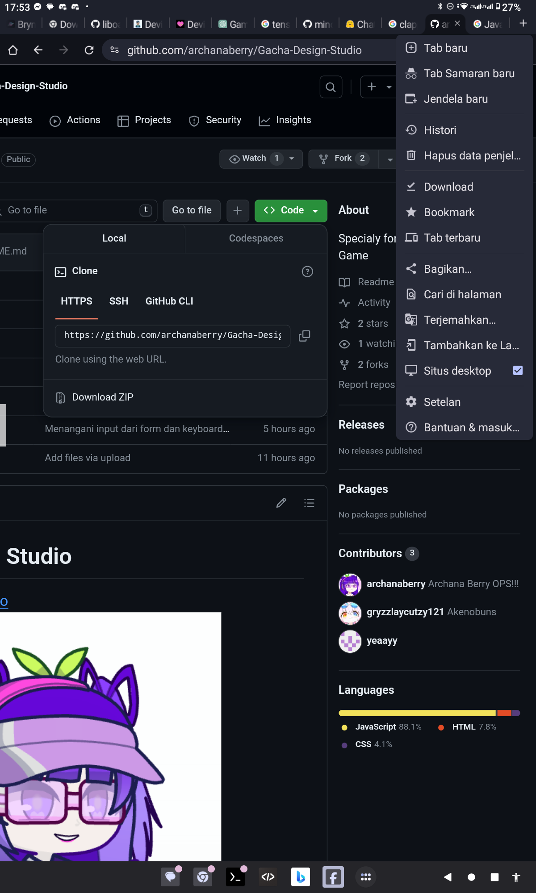

## Cara menambahkan assets karakter ke studio poser
```
---
JavaScript
File: js/poser/studiopose.js /or/ studiosandbox.js
---

/**
 * ============================================================
 * DEFAULT CHARACTER LAYER TEMPLATE
 * ============================================================
 * 
 * STRUKTUR LAYER DENGAN PROPERTIES LENGKAP:
 * 
 * options: {
 *   // POSISI (Panel2: xCoord, yCoord)
 *   "posX": 0,        // x0 - Posisi horizontal awal
 *   "posY": 0,        // y1 - Posisi vertikal awal
 *   
 *   // ROTASI & SKALA (Panel2: rotationControl, scale)
 *   "rotation": 0,    // Rotate 0-360 derajat
 *   "scale": 1,       // Scale 0-2+ (1=normal)
 *   
 *   // SKEW (Panel2: skewXControl, skewYControl)
 *   "skewX": 0,       // Skew X -45 hingga 45
 *   "skewY": 0,       // Skew Y -45 hingga 45
 *   
 *   // FLIP (Panel2: flipHorizontal, flipVertical)
 *   "flipX": false,   // Flip horizontal
 *   "flipY": false,   // Flip vertikal
 *   
 *   // UKURAN (Panel2: width, height)
 *   "width": null,    // Auto jika null
 *   "height": null,   // Auto jika null
 *   
 *   // OPASITAS (Panel2: opacitySlider)
 *   "opacity": 1,     // 0-1 (1=fully opaque)
 *   
 *   // WARNA (untuk SVG)
 *   "color": null,    // Warna global
 *   "color0": null,   // Warna src[0] - format: #RRGGBB atau #RRGGBBAA (dengan alpha)
 *   "color1": null,   // Warna src[1] - format: #RRGGBB atau #RRGGBBAA
 *   
 *   // GRADASI (untuk SVG dengan gradient)
 *   "color0g0": null,    // Warna gradasi pertama di src[0], gradient index 0
 *   "color0g0pX": 0,     // Posisi X gradient pertama di src[0]
 *   "color0g0pY": 0,     // Posisi Y gradient pertama di src[0]
 *   "color0g1": null,    // Warna gradasi kedua di src[0], gradient index 1
 *   "color0g1pX": 0,     // Posisi X gradient kedua di src[0]
 *   "color0g1pY": 0      // Posisi Y gradient kedua di src[0]
 * }
 * 
 * FORMAT WARNA:
 * - #RRGGBB     - Solid color (red, green, blue)
 * - #RRGGBBAA   - Color dengan alpha/transparency (AA = 00 transparent hingga FF opaque)
 * 
 * CATATAN: Setiap layer siap di-customize di panel2 secara real-time
 * Refer: LAYER_OPTIONS_STRUCTURE.md untuk dokumentasi lengkap
 * Refer: LAYER_TEMPLATE_EXAMPLES.js untuk contoh implementasi
 * 
 * STRUKTUR OPTIONS BARU:
 * - Properties global (posX, posY, rotation, scale, dll) diterapkan ke semua src
 * - Properties per-src (posX0, posY1, color2, opacity3, dst) override global
 * - Semua properties bersifat OPSIONAL - hanya define yang dibutuhkan
 * - Gradient support: color0g0, color0g1, dll untuk setiap gradient stop
 * ============================================================
 */

const layers = [
    // ========== LENGAN ATAS KANAN ==========
    {
      "layerName": "Lengan atas kanan",
      "src": [
        "assets/character/base/arm1.svg",    // src0 - outline
        "assets/character/base/arm2.svg"     // src1 - base color
      ],
      "options": {
        // Global position
        "posX": 65,
        "posY": 127,
        
        // Per-src colors
        "color0": "#000000",                 // Outline hitam
        "color1": "#FFCC99",                 // Skin tone
        
        // Global transformations
        "rotation": 0,
        "scale": 1,
        "flipX": true,                       // Flip untuk kanan
        "flipY": false,
        "skewX": 0,
        "skewY": 0,
        "width": null,
        "height": null,
        "opacity": 1
      }
    },
    // ========== LENGAN BAWAH KANAN ==========
    {
      "layerName": "Lengan bawah kanan",
      "src": [
        "assets/character/base/hand1.svg",   // src0 - outline
        "assets/character/base/hand2.svg"    // src1 - base
      ],
      "options": {
        "posX": 73,
        "posY": 151,
        "color0": "#000000",
        "color1": "#FFCC99",
        "rotation": 0,
        "scale": 1,
        "flipX": true,
        "flipY": false,
        "skewX": 0,
        "skewY": 0,
        "width": null,
        "height": null,
        "opacity": 1
      }
    },
    // ========== TANGAN KANAN ==========
    {
      "layerName": "Tangan kanan",
      "src": [
        "assets/character/base/finger3.svg", // src0 - outline
        "assets/character/base/finger4.svg"  // src1 - base
      ],
      "options": {
        "posX": 80,
        "posY": 170,
        "color0": "#000000",
        "color1": "#FFCC99",
        "opacity0": 1,
        "opacity1": 0.95,
        "rotation": 0,
        "scale": 1,
        "flipX": true,
        "flipY": false,
        "skewX": 0,
        "skewY": 0,
        "width": null,
        "height": null
      }
    },
  
    // ========== KAKI KANAN ==========
    {
      "layerName": "Paha atas kanan",
      "src": [
        "assets/character/base/leg1.svg",    // src0 - outline
        "assets/character/base/leg2.svg"     // src1 - base
      ],
      "options": {
        "posX": 65.5,
        "posY": 178,
        "color0": "#000000",
        "color1": "#FFCC99",
        "rotation": 0,
        "scale": 1,
        "flipX": true,
        "flipY": false,
        "skewX": 0,
        "skewY": 0,
        "width": null,
        "height": null,
        "opacity": 1
      }
    },
    {
      "layerName": "Kaki kanan",
      "src": [
        "assets/character/base/foot1.svg",   // src0 - outline
        "assets/character/base/foot2.svg"    // src1 - base
      ],
      "options": {
        "posX": 66.5,
        "posY": 206,
        "color0": "#000000",
        "color1": "#FFCC99",
        "rotation": 352,
        "scale": 1,
        "flipX": false,
        "flipY": false,
        "skewX": 0,
        "skewY": 0,
        "width": null,
        "height": null,
        "opacity": 1
      }
    },
  
    // ========== BADAN ==========
    {
      "layerName": "Badan",
      "src": [
        "assets/character/base/body1.svg",   // src0 - outline
        "assets/character/base/body2.svg"    // src1 - base color
      ],
      "options": {
        "posX": 44,
        "posY": 112,
        "color0": "#000000",
        "color1": "#FF69B4",                 // Pink untuk baju
        "opacity0": 1,
        "opacity1": 1,
        "rotation": 0,
        "scale": 1,
        "flipX": false,
        "flipY": false,
        "skewX": 0,
        "skewY": 0,
        "width": null,
        "height": null
      }
    },
  
    // ========== KEPALA ==========
    {
      "layerName": "Kepala",
      "src": [
        "assets/character/base/head1.svg",   // src0 - outline
        "assets/character/base/head2.svg"    // src1 - base
      ],
      "options": {
        "posX": 0,
        "posY": 0,
        "color0": "#000000",
        "color1": "#FFCC99",
        "opacity": 1,
        "rotation": 0,
        "scale": 1,
        "flipX": false,
        "flipY": false,
        "skewX": 0,
        "skewY": 0,
        "width": null,
        "height": null
      }
    },
  
    // ========== LENGAN ATAS KIRI ==========
    {
      "layerName": "Lengan atas kiri",
      "src": [
        "assets/character/base/arm1.svg",    // src0 - outline
        "assets/character/base/arm2.svg"     // src1 - base
      ],
      "options": {
        "posX": 34.5,
        "posY": 127.5,
        "color0": "#000000",
        "color1": "#FFCC99",
        "rotation": 0,
        "scale": 1,
        "flipX": false,
        "flipY": false,
        "skewX": 0,
        "skewY": 0,
        "width": null,
        "height": null,
        "opacity": 1
      }
    },
    {
      "layerName": "Lengan bawah kiri",
      "src": [
        "assets/character/base/hand1.svg",   // src0 - outline
        "assets/character/base/hand2.svg"    // src1 - base
      ],
      "options": {
        "posX": 26.5,
        "posY": 152,
        "color0": "#000000",
        "color1": "#FFCC99",
        "rotation": 0,
        "scale": 1,
        "flipX": false,
        "flipY": false,
        "skewX": 0,
        "skewY": 0,
        "width": null,
        "height": null,
        "opacity": 1
      }
    },
    {
      "layerName": "Tangan kiri",
      "src": [
        "assets/character/base/finger1.svg", // src0 - outline
        "assets/character/base/finger2.svg"  // src1 - base
      ],
      "options": {
        "posX": 20,
        "posY": 172,
        "color0": "#000000",
        "color1": "#FFCC99",
        "opacity0": 1,
        "opacity1": 0.95,
        "rotation": 0,
        "scale": 1,
        "flipX": false,
        "flipY": false,
        "skewX": 0,
        "skewY": 0,
        "width": null,
        "height": null
      }
    },
  
    // ========== KAKI KIRI ==========
    {
      "layerName": "Paha atas kiri",
      "src": [
        "assets/character/base/leg1.svg",    // src0 - outline
        "assets/character/base/leg2.svg"     // src1 - base
      ],
      "options": {
        "posX": 42.5,
        "posY": 180.5,
        "color0": "#000000",
        "color1": "#FFCC99",
        "rotation": 0,
        "scale": 1,
        "flipX": false,
        "flipY": false,
        "skewX": 0,
        "skewY": 0,
        "width": null,
        "height": null,
        "opacity": 1
      }
    },
    {
      "layerName": "Kaki kiri",
      "src": [
        "assets/character/base/foot1.svg",   // src0 - outline
        "assets/character/base/foot2.svg"    // src1 - base
      ],
      "options": {
        "posX": 40.5,
        "posY": 208,
        "color0": "#000000",
        "color1": "#FFCC99",
        "rotation": 0,
        "scale": 1,
        "flipX": false,
        "flipY": false,
        "skewX": 0,
        "skewY": 0,
        "width": null,
        "height": null,
        "opacity": 1
      }
    },

    // ========== CONTOH TEXT LAYER (Opsional - Gunakan jika ada feature teks) ==========
     {
       "layerName": "Nama Karakter",
       "src": ["text://characterName"],
       "isTextLayer": true,
       "options": {
         "posX0": 50,
         "posY0": 300,
         "fontFamily0": "Arial",
         "fontSize0": 28,
         "fontWeight0": "bold",
         "color0": "#000000",
         "textAlign0": "center",
         "textStroke0": true,
         "textStrokeColor0": "#000000",
         "textStrokeWidth0": 2,
         "opacity0": 1,
         "width0": 200
       }
     }
  ]
```

## Kekurangan dan Kendala

* ✅ Berhasil di tangani.
* ❌ Belum di tangani.

| Kekurangan                                    | Deskripsi                                                                                      | Status |
|-----------------------------------------------|------------------------------------------------------------------------------------------------|--------|
| Keterbatasan Aset                             | Saat ini, game masih terbatas dalam jumlah aset yang tersedia karena baru dirilis.             | ❌ |
| Karakter Dummy/Template                       | Karakter dalam game masih dalam bentuk dummy atau template kosong, belum memiliki rambut atau aksesori yang lengkap. | ✅ |
| Zoom Belum Aktif                              | Fitur zoom untuk melihat detail lebih jauh dalam pembuatan karakter atau desain pakaian masih belum aktif. | ✅ |
| Flip Vertikal dan Horizontal Bermasalah      | Fitur flip vertikal dan horizontal saat ini mengalami masalah teknis yang membuatnya ngebug.   | ✅ |
| Selektor Karakter Belum Aktif Sepenuhnya     | Selektor karakter masih belum berfungsi sepenuhnya, sehingga pengguna belum dapat dengan mudah memilih karakter yang ingin dimodifikasi. | ✅ |
| Tidak Ada Fitur Berbagi Karakter dengan Kode atau Upload Aset SVG | Fitur untuk berbagi karakter menggunakan kode atau mengunggah aset SVG sebagai tambahan aset belum ditambahkan. | ✅ |
| Input box Lebar/Width, dan Tinggi/Height nya bermasalah | Ketika bisa diubah nilai nya tetapi tidak mengalami perubahan posisi | ✅ |
| Pengingat jika tidak sengaja ke refresh | Untuk mencegah kehilangan posisi pose ataupun rangkai karakter Gacha mu | ❌ |
| Belum ada main menu | Supaya terkesan ada menu awal permainan | ✅ |
| Belum ada BGM | Fitur untuk menyegarkan suasana dengan musik yang aesthetic agar tidak monoton (hanya saja harus pakai aplikasi apk dikhususkan!) | ✅ |
| Design UI/UX masih berantakan | Untuk menambah ke estetika game ini agar menarik pengunjung :3 | 💡 |
| Loading Main Menu | Berfungsi untuk meload semua source game web ini | ✅ |
| Resource web terkompilasi .dgc (Data Gacha resource Compiled) | Berfungsi untuk mengompres dan mengoptimalkan webview engine seperti .swf (Adobe Flash) | ❌ |
| TransVar (Translator Variable) dukungan library bahasa berbasis javascript | Multibahasa bisa dilakukan dengan otomatis (mengambil konfigurasi sistem) atau disetel sesuai pengguna | 💡 |
| Sudah ditambah ikon thumbnail karakter | Ikon karakter agar mudah dicari dan menambah estetika profile karakter gacha mu :> | ✅ |

## Tangkapan Layar
* Main menu
Tablet 1200x2000 (Portrait mode)
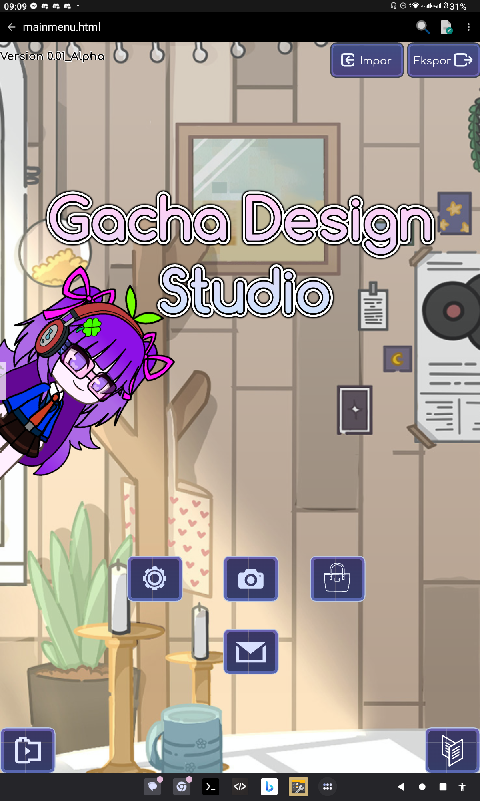

* Mode Studio Pose
Tablet 2000x1200 (Landscape mode)
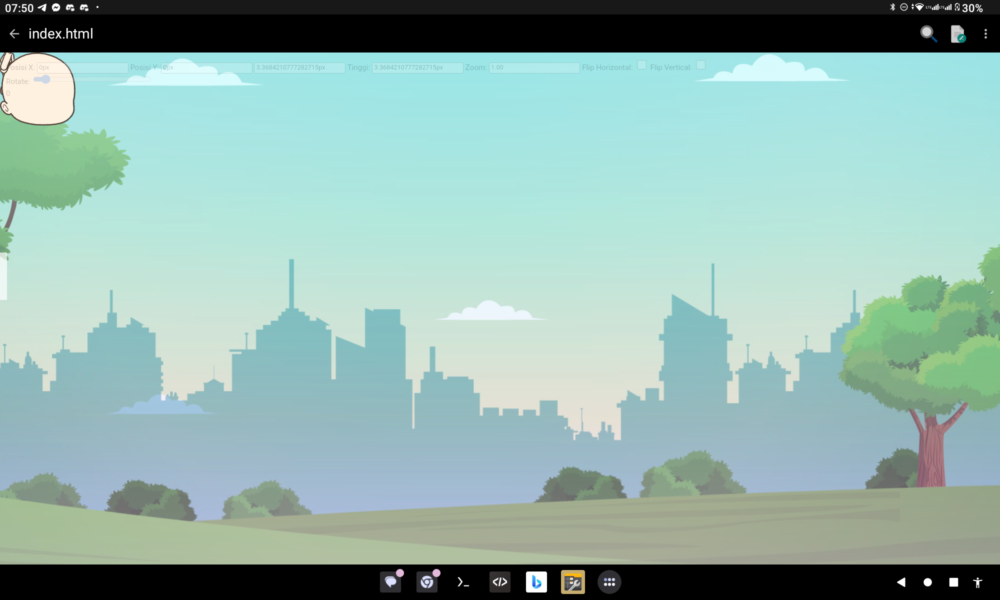
PC/Laptop 1366x768 (Landscape mode)
Diperbarui
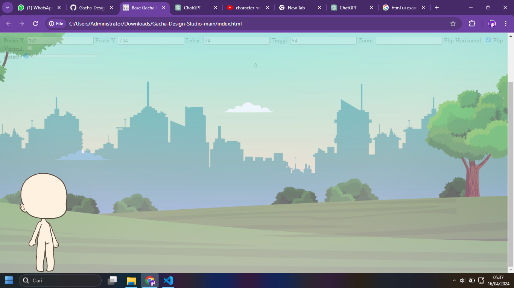

* Mode Studio Sandbox (New Arrived)
1. Tablet/PC 1200x2000 (Potrait mode)
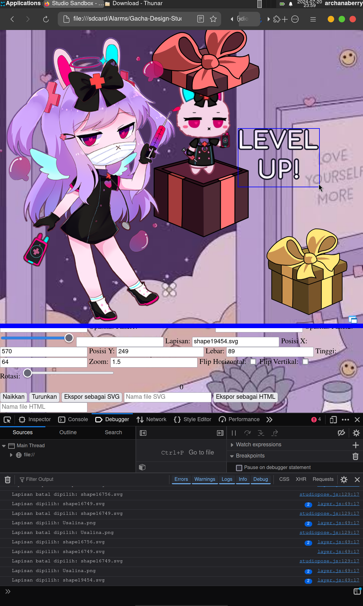
2. Tablet/PC 2000x1200 (landscape mode)
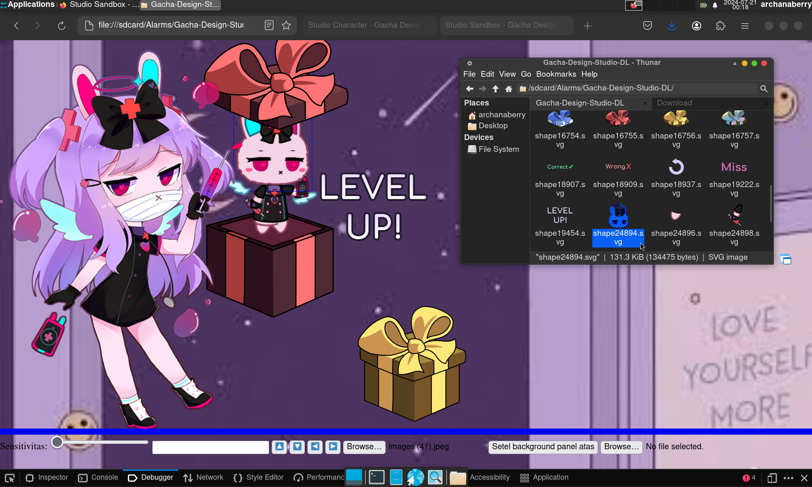

## Bahasa pemrograman yang dipakai
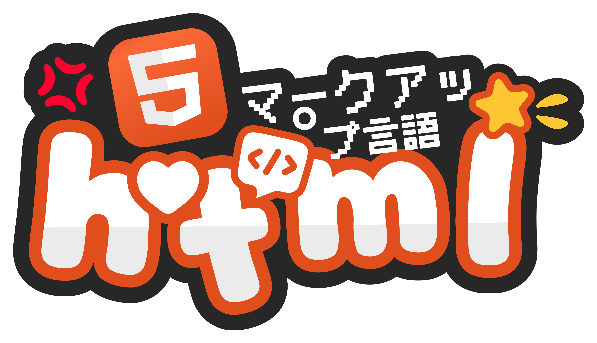
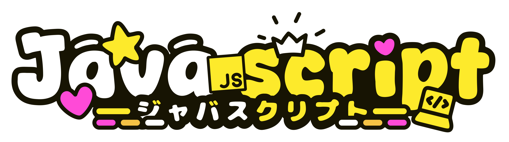
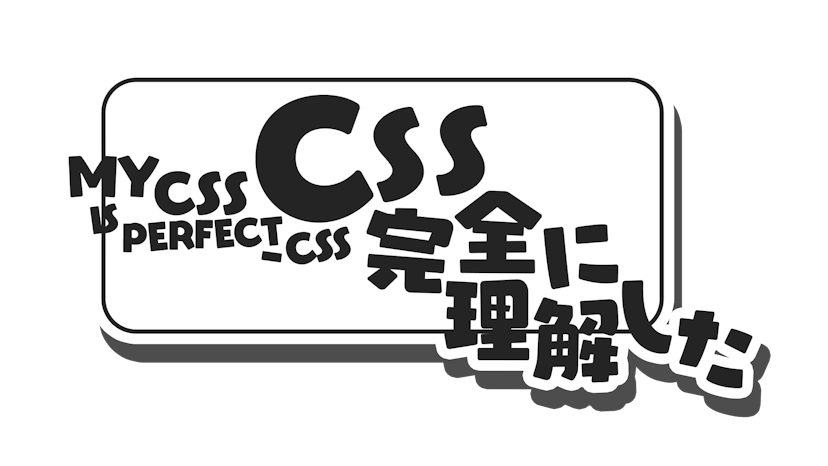

## Terimakasih untuk:

